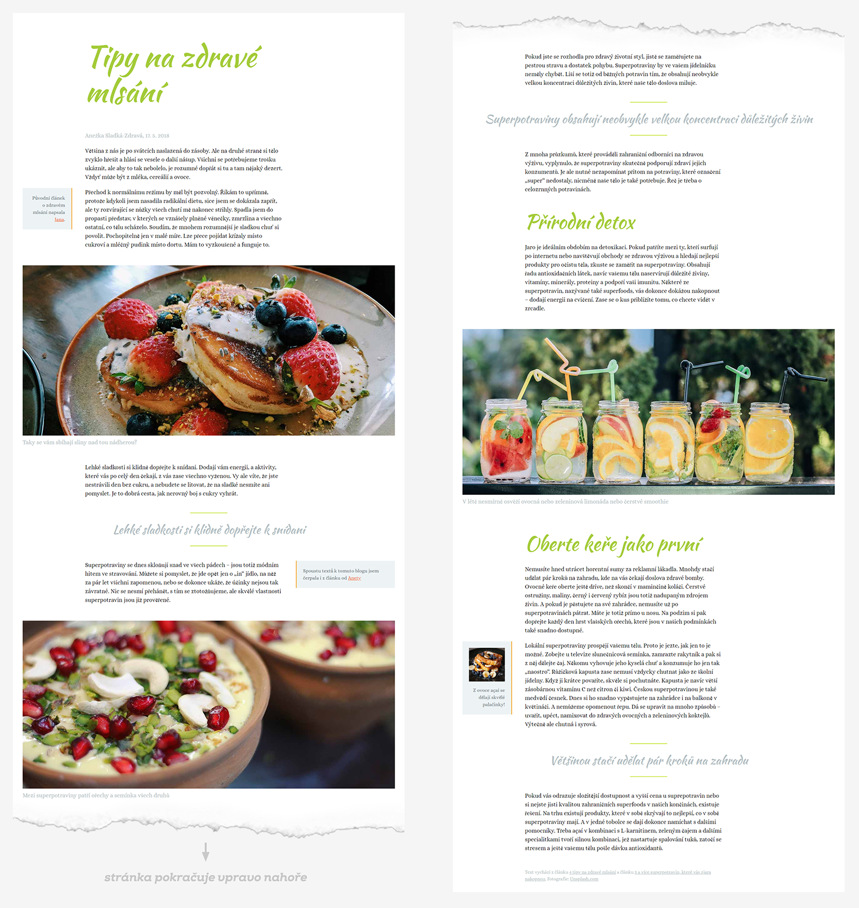
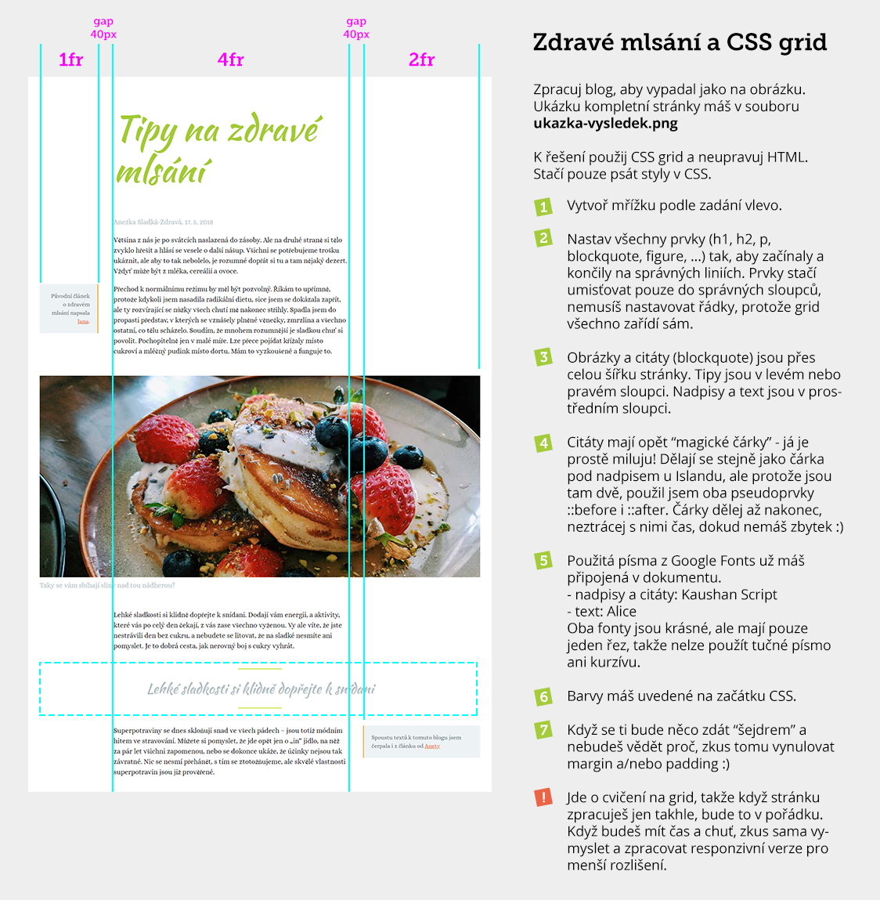

# Grid blog

Dobrovolný kol pro kurz Staň se kóderkou od Czechitas. Když ho odevzdáš, koučové ti k němu napíšou zpětnou vazbu.

- [Cíl úkolu](#Cíl-úkolu)
- [Grafické zadání](#Grafické-zadání)
- [Jak si stáhnout podklady](#Jak-si-stáhnout-podklady)

Než začneš s projektem cokoliv dělat, přečti si prosím celý tento text až do konce.

Za úkol máš nakódovat design podle grafického návrhu. Jedná se o stránku s článkem na blogu o zdravém jídle. Na výsledný vzhled projektu v plné velikosti se podívej na obrázku [ukazka- vysledku.png](ukazka-vysledku.png).

Hlavní pointa tohoto úkolu je ukázat, jak jde (relativně) komplexní design nakódovat pomocí CSS gridu s naprostým minimem kódu. Více v sekci [Cíl úkolu](#Cíl-úkolu).

## Cíl úkolu

Cílem projektu je procvičit si použití různých technik:
- **CSS grid**
  - tento úkol má ukázat, jak díky CSS gridu můžeme nakódovat celou stránku s naprostým minimem kódu, protože se můžeme spolehnout na to, jak grid automaticky rozmisťuje prvky do mřížky, i když mu poskytneme jen minimum nezbytných informací
  - stačí totiž, když jednotlivým prvkům (odstavcům, nadpisům, citátům, obrázkům, apod.) **nastavíš, ve kterém sloupci (na které linii) mají v mřížce začínat a končit**. Nemusíš se starat o řádky. Grid bude prvky umisťovat postupně a bude si potřebné řádky přidávat sám.
  - není potřeba do HTML nic přidávat - tentokrát zkus prostě stylovat přímo HTML značky (odstavcem, nadpisy, obrázky). Jen několik prvků, které to nezbtně potřebují, má přidanou CSS třídu.
- **Responzivní webdesign**
  - v tomto úkolu jde především u ukázání možností gridu, takže když stránku nakóduješ jen v počítačové verzi podle grafického zadání, tak to úplně stačí
  - máš-li čas a chceš trénovat, zkus vymyslet, jak by mohla vypadat mobilní a tabletová verze tohoto zadání a nakóduj je
- **CSS proměnné**
  - chceš-li naučit sama něco navíc, přečti si komentář uvedený v CSS souboru a nastuduj si, jak použít tzv. *CSS proměnné* (*CSS variables*, nebo spávněji *CSS custom properties*)

## Grafické zadání

Vše potřebné (rozměry, použitá písma, apod.) najdeš na obrázku *zadani-ukolu.png*. Použité barvy máš připravené v CSS souboru *style.css*.

## Jak si stáhnout podklady

1. Udělej si **fork** této repozitáře - tím se ti úkol zkopíruje do tvého GitHub profilu.
2. Forknutou repozitář si naklonuj k sobě na disk.

Pokud nevíš, co je to **fork repozitáře** a jak ho provést, podívej se na [krátké video](https://youtu.be/K7rE3jRCjD4).

