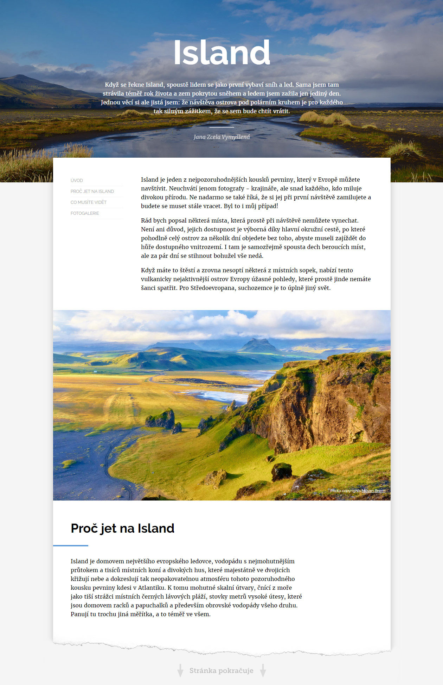
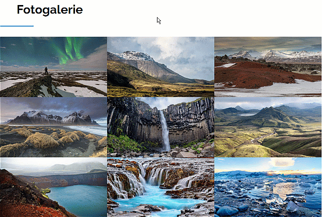

# Island

Bonusový úkol pro kurz Staň se kóderkou od Czechitas. Tento úkol se neodevzdává a nehodnotí. Vypracuj si ho pro sebe jako trénink kódování CSS.

- [Cíl úkolu](#Cíl-úkolu)
- [Grafické zadání](#Grafické-zadání)
- [Jak si stáhnout podklady](#Jak-si-stáhnout-podklady)

Než začneš s projektem cokoliv dělat, přečti si prosím celý tento text až do konce.

Za úkol máš nakódovat design podle grafického návrhu. Jedná se o stránku z webu o cestování na Islandu. Na výsledný vzhled projektu se podívej na obrázku *ukazka-vysledku.jpg*.

## Cíl úkolu

Cílem projektu je procvičit si použití různých technik:
- **Kóderský cit pro detail**
  - zadání v tomto úkolu je opět záměrně trochu vágní - je na tobě, aby sis spoustu rozměrů sama změřila přímo v obrázku nebo je prostě jenom odhadla, aby výsledek vypadal co nejpodobněji zadání
  - trénuj si kóderský cit pro detail a pokus se zadání přiblížit co nejvíc
- **Flexbox nebo grid**
  - je na tobě, jakou techniku použiješ - v tomto úkolu není nic extrémně obtížného a stránku lze snadno nakódovat pomocí flexboxu nebo gridu (dokonce i úplně bez nich) - vyber si, co ti více vyhovuje
- **Responzivní webdesign**
  - v zadání jsou tři náhledy - pro každou responzivní verzi jeden (mobil, tablet, počítač)
  - změny v rozložení stránky nejsou mezi jednotlivými verzemi nijak divoké, ale přeci jen existují - podrobnosti v sekci Grafické zadání
- **Absolutní pozicování**
  - na popisku uvnitř obrázků budeš muset použít absolutní pozicování

## Grafické zadání

Náhledy responzivních verzí stránky najdeš v obrázcích:
- mobil: [vysledek-1-mobil.jpg](vysledek-1-mobil.jpg)
- tablet: [vysledek-2-tablet.jpg](vysledek-2-tablet.jpg)
- počítač: [vysledek-3-pc.jpg](vysledek-3-pc.jpg)

Tentokrát je obrázkové zadání záměrně vágní a neobsahuje podrobné informace o rozestupech prvků, velikostech paddingu, apod. Je na tobě, abys rozměry odhadla tak, aby výsledná stránka vypadala co nejpodobnější zadání.

Použitá písma a barvy jsou uvedené v komentáři v souboru *style.css*.

### Responziví breakpointy

**Mobilní verze - šířka do 540px**
- všechno je pod sebou v jedné úzké nudli
- v menu jsou položky pod sebou, menu samotné je nad obsahem
- v galerii jsou všechny obrázky pod sebou
- popisky k obrázkům jsou vždy pod obrázkem (u brázků vložených v textu i v galerii)

**Tabletové verze - šířka 540px až 960px**
- skoro všechno je pod sebou
- v menu jsou položky vedle sebe, menu samotné je nad obsahem
- v galerii jsou vždy 2 obrázky vedle sebe (obrázků je 9, zbyde ti na konci jeden prázdný obdélníček)
- popisky k obrázkům v textu jsou uvnitř obrázku blízko k jeho pravému dolnímu rohu
- popisky k obrázkům v galerii jsou skryté (nebo animované, viz dále)

**Počítačová verze - šířka nad 960px**
- hlavička s obrázkem na pozadí je přes celou šířku stránky
- obsah je v bílém pruhu uprostřed stránky omezeném na maximální šířku 960px
- bílý obdélník s obsahem je vysunutý kousek nahoru do hlavičky (věděla jsi, že margin může být i záporné číslo?)
- v menu jsou položky pod sebou, menu je omezené na úzký proužek a je vlevo od úvodního odstavce textu
- jednotlivé bloky s textem mají v počítačové verzi vždy na jedné straně odsazení pomocí paddingu - všimni si, že se to střídá a jednou je mezera vpravo a pak zase vlevo, aby web vypadal vizuálně zajímavě
- v galerii jsou vždy 3 obrázky vedle sebe
- popisky k obrázkům vloženým do textu jsou stejné jako v tabletové verzi (v pravém dolním rohuuvnitř obrázku)
- popisky k obrázkům v galerii jsou stejné jako v tabletové verzi (skryté nebo animované, viz dále)

### Animovaná galerie

Pokud si na to troufáš, tak v tabletové a počítačové verzi můžeš udělat animované popisky k obrázkům v galerii. Mohlo by to vypadat třeba takto:

## Jak si stáhnout podklady

1. Udělej si **fork** této repozitáře - tím se ti úkol zkopíruje do tvého GitHub profilu.
2. Forknutou repozitář si naklonuj k sobě na disk.

Pokud nevíš, co je to **fork repozitáře** a jak ho provést, podívej se na [krátké video](https://youtu.be/K7rE3jRCjD4).

