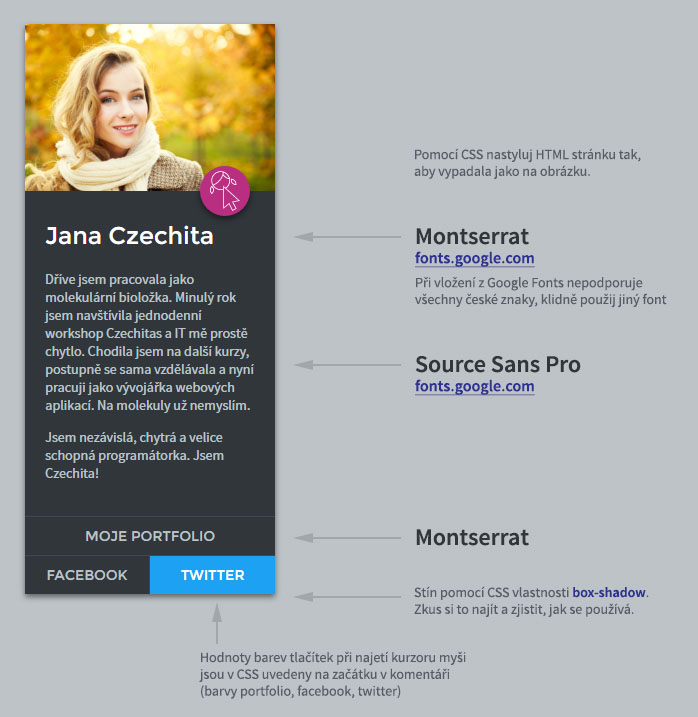

# Bonusový úkol: Profil

Bonusový úkol pro kurz Staň se kóderkou od Czechitas. Tento úkol se neodevzdává a nehodnotí. Vypracuj si ho pro sebe jako trénink kódování CSS.

## Návod k úkolu

1. Udělej si **fork** této repozitáře - tím se ti úkol zkopíruje do tvého GitHub profilu. Forknutou repozitář si naklonuj k sobě na disk. Co je to fork a jak ho provést se dozvíš v [krátkém videu](https://youtu.be/K7rE3jRCjD4).

2. V podkladech pro úkol máš připravený HTML a CSS soubor.

3. V tomto úkolu je **HTML kompletně hotové a nemusíš ho vůbec měnit**. (Ale můžeš, pokud chceš.)

4. Nakóduj CSS, aby stránka vypadala jako na obrázku. V souboru *zadani-ukolu.jpg* uvidíš, jak má stránka vypadat a jaká jsou na ní použitá písma.

5. Na obrázku se zadáním nejsou uvedené žádné rozměry. Stačí ti pouze dva:

- **šířka** celého rámečku s profilem je **250px** (nebo 300px, pokud se ti to bude líbit víc)
- **padding** mezi okrajem rámečku a obsahem uvnitř je **20px**

Snaž se na věci přijít sama, ale když se na něčem zasekneš, neboj se nás zeptat na Slacku. Na tvoje dotazy ti rádi odpovíme.
