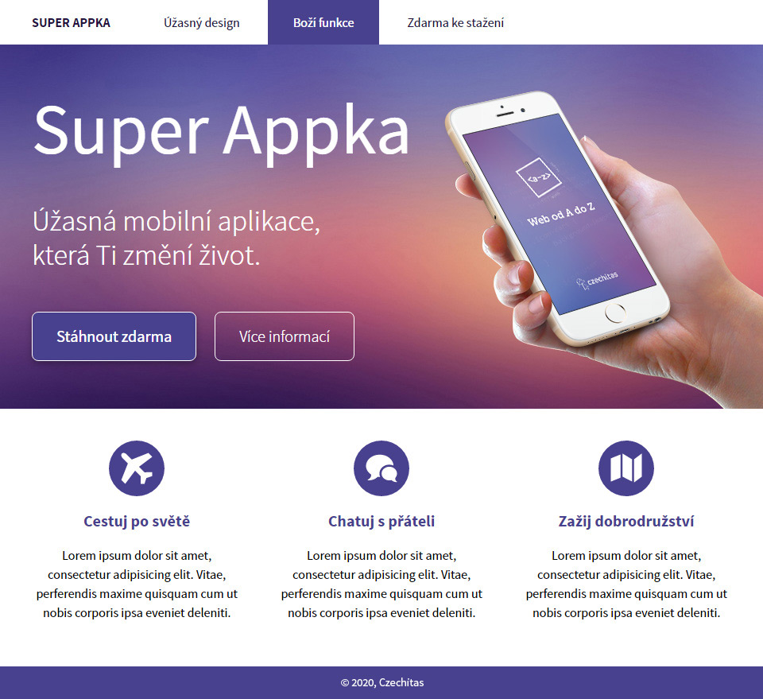
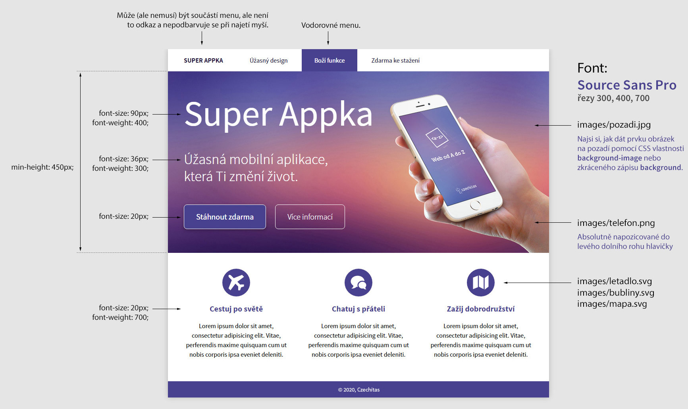

# Superappka

Bonusový úkol pro kurz Staň se kóderkou od Czechitas. Tento úkol se neodevzdává a nehodnotí. Vypracuj si ho pro sebe jako trénink kódování CSS. Toto je standardní varianta úkolu, více se dozvíš v sekci Obtížnosti úkolu.

- [Cíl úkolu](#Cíl-úkolu)
- [Grafické zadání](#Grafické-zadání)
- [Obtížnosti úkolu](#Obtížnosti-úkolu)
- [Jak si stáhnout podklady](#Jak-si-stáhnout-podklady)

Než začneš s projektem cokoliv dělat, přečti si prosím celý tento text až do konce.

Za úkol máš nakódovat design podle grafického návrhu. Jedná se o stránku s prezentací fiktivní mobilní aplikace. Na výsledný vzhled projektu se podívej na obrázku *ukazka-vysledku.jpg*.

## Cíl úkolu

Cílem projektu je procvičit si použití různých technik:
- **Kóderský cit pro detail**
  - zadání v tomto úkolu je záměrně trochu vágní
  - je na tobě, aby sis spoustu rozměrů sama změřila přímo v obrázku nebo je prostě jenom odhadla, aby výsledek vypadal co nejpodobněji zadání
  - trénuj si kóderský cit pro detail a pokus se přiblížit co nejvíc
- **Responzivní webdesign**
  - v zadání je pouze náhled počítačové verze
  - zkus sama vymyslet, jak by mohla vypadat mobilní a tabletová verze
  - nezřídka se stane, že ti designér dodá návrh pouze jedné verze a čeká, že zbytek doděláš sám (v tom případě je to špatný designér, ale tato vědomost ti v tvém trápení nepomůže)
  - nakóduj responzivní verzi pomocí principů mobile first
- **Flexbox**
  - toto není složitý úkol na flexbox, vystačíš si se základním nastavením flexboxu
  - použij flexbox pro menu a pro 3 sloupce v dolní části stránky
  - když se ti podaří použít flexbox i na horní hero sekci, bude to super
- **Absolutní pozicování**
  - ruku s telefonem uvnitř horní hero sekce můžeš umístit do pravého dolního rohu banneru pomocí absolutního pozicování
  - pokud vymyslíš, jak se absolutnímu pozicování vyhnout a dát ruku na stejné místo např. pomocí flexboxu, bude to jen plus

## Grafické zadání

Rozměry (některé), použitá písma, barvy, apod. najdeš na obrázku *zadani-ukolu.jpg*. Spoustu z těchto informací máš připravenou také v komentáři v souboru *style.css*.

Tentokrát je obrázkové zadání záměrně vágní a neobsahuje podrobné informace o rozestupech prvků, velikostech paddingu, apod. Je na tobě, abys rozměry odhadla tak, aby výsledná stránka vypadala co nejpodobnější zadání.

Stránka by měla být responzivní, ale designér byl lenoch a dodal pouze návrh počítačové verze. Je na tobě, abys sama vymyslela, jak bude vypadat mobilní a tabletová podoba stránky.

Z přiloženého obrázku to není moc poznat, ale v širokém okně prohlížeče je celá stránka umístěná uprostřed okna v "pruhu" širokém maximálně 960px. O to se stará prvek `
...
`, který je hned jako první uvnitř body. Tento prvek je jako jedinný i v těžší variantě už přidaný do HTML a nastylovaný v CSS, tak se ho nelekni.

## Obtížnosti úkolu

Zadání tohoto projektu je vytvořeno ve dvou úrovních obtížnosti. Tento repozitář obsahuje výchozí **standardní úroveň obtížnosti**. Pokud máš méně času nebo s úkolem hodně bojuješ, můžeš zkusit lehčí variantu úkolu.

### Standardní obtížnost
- obsažená v tomto repozitáři
- v HTML najdeš pouze obsahové elementy (nadpisy, odstavce, obrázky)
- sama si do HTML musíš dopsat další strukturu, která je nutná, abys mohla HTML nastylovat podle grafického zadání
- musíš vymyslet, do jakých prvků obsah zabalíš a jaké třídy jim přidáš
- nezapomeň si připojit správná písma z Google Fonts

### Lehčí obtížnost
- dostupná v [druhém repozitáři](https://github.com/Czechitas-Koderka-podklady/PROJEKT-Superappka-lehci)
- grafické zadání je stejné, ale v HTML je kompletně připravený obsah včetně struktury, obalových prvků a přidaných CSS tříd
- v HTML už máš připojená písma z Google Fonts
- v této obtížnosti nemusíš HTML vůbec upravovat - stačí si ho prostudovat, abys věděla jaké prvky/třídy máš stylovat a "jenom" k nim napsat CSS

Je úplně v pořádku, pokud si nakonec zvolíš jednodušší variantu (např. kvůli nedostatku času), ale doporučuji, abys nejprve zkusila standardní obtížnost, kde si musíš sama vytvořit i HTML strukturu a pojmenovat CSS třídy. Není to zase o tolik těžší a v reálném životě ti také nikdo HTML připravovat nebude. Jako kóderka dostaneš grafický návrh a ten budeš muset převést do HTML a CSS. Budeš-li si u bonusových úkolů volit jednodušší obtížnosti, nakonec zjistíš, že sice umíš CSS, ale dělá ti problém vymyslet a napsat si vlastní HTML.

## Jak si stáhnout podklady

1. Udělej si **fork** této repozitáře - tím se ti úkol zkopíruje do tvého GitHub profilu.
2. Forknutou repozitář si naklonuj k sobě na disk.

Pokud nevíš, co je to **fork repozitáře** a jak ho provést, podívej se na [krátké video](https://youtu.be/K7rE3jRCjD4).

